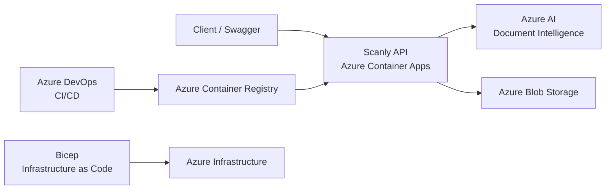

# Scanly AB – Technical Reflection

## Architecture Overview

Scanly is a cloud-based solution for automatic invoice processing. The user uploads an invoice as a PDF or image to our ASP.NET Core API.

The API sends the invoice to Azure AI Document Intelligence, where the information in the invoice is analyzed. The result is then mapped to Scanly's own models and stored as JSON in Azure Blob Storage.

The application is containerized with Docker and runs in Azure Container Apps. Docker images are stored in Azure Container Registry, and the infrastructure is defined using Bicep. Azure DevOps is used for version control, Pull Requests, testing, and CI/CD.



---

## 1. Container Apps

We chose Azure Container Apps because Scanly is a containerized ASP.NET Core API that needs to run in Azure without requiring us to manage a complete Kubernetes cluster.

Container Apps is suitable for our project because it supports features such as ingress, container revisions, autoscaling, and Managed Identity. Azure manages much of the underlying infrastructure, which allows us to focus more on the application and deployment.

In the development environment, we use:

```text
minReplicas = 1
maxReplicas = 2
```

For the intended production configuration, we use:

```text
minReplicas = 2
maxReplicas = 5
```

One limitation of Container Apps is that we do not have the same level of control over nodes, networking, scheduling, and Kubernetes resources as we would have with Azure Kubernetes Service (AKS).

For Scanly, we do not need that level of control at the moment. If the system grows in the future and contains several services that require more advanced Kubernetes configuration or direct control over the cluster, AKS could be a better alternative.

For our current project, Container Apps is a suitable choice because it is easier to deploy and manage.

---

## 2. CI/CD

We use Azure DevOps for our Git workflow, Pull Requests, and CI/CD.

Our branch flow is:

```text
task branch
     ↓
    dev
     ↓
   main
```

When we work on a task, we create a task branch from `dev`. When the change is finished, we create a Pull Request back to `dev`, where the changes can be reviewed before they are merged.

`dev` is used for integration and CI, while `main` contains the stable version and is used for the deployment flow.

### Continuous Integration

The CI process:

1. restores the .NET dependencies,
2. builds the API,
3. builds the test project,
4. runs the automated tests.

The tests use fake services for invoice analysis and storage. This means that the tests can run without making real requests to Azure AI Document Intelligence or Blob Storage every time.

### Continuous Deployment

The deployment flow looks like this:

```text
Code merged to main
        ↓
Restore and build
        ↓
Automated tests
        ↓
Deploy bootstrap.bicep
        ↓
Build Docker image
        ↓
Tag Docker image with Build ID
        ↓
Push to Azure Container Registry
        ↓
Deploy main.bicep
        ↓
Update Azure Container App
        ↓
Verify /health
```

`bootstrap.bicep` is deployed first to make sure that Azure Container Registry exists before the Docker image is built and pushed.

The Docker image is tagged with the Azure DevOps Build ID. This allows us to connect a specific image to the pipeline run that created it.

After the image has been pushed, the rest of the infrastructure is deployed through `main.bicep`. Finally, `/health` is checked to verify that the API is available.

If the build or automated tests fail, the pipeline stops and no new deployment is made. This reduces the risk of deploying a version that has already failed during CI.

---

## 3. Infrastructure as Code – Bicep

We use Bicep to define the Azure infrastructure as code instead of creating and configuring all resources manually in the Azure Portal.

Our `infra` folder contains:

```text
infra/
├── bootstrap.bicep
├── main.bicep
├── dev.bicepparam
└── prod.bicepparam
```

### bootstrap.bicep

`bootstrap.bicep` is used for Azure Container Registry.

The Container Registry needs to exist before the Docker image can be pushed, so it is handled early in the deployment process.

### main.bicep

`main.bicep` manages resources and configuration such as:

- Storage Account
- Blob container
- Container Apps Environment
- Container App
- Managed Identity
- RBAC
- ACR pull permissions
- application configuration
- autoscaling

By defining the infrastructure in Bicep, it can be version controlled together with the rest of the project.

### Development and Production

We use separate parameter files for development and the intended production environment.

Development uses:

```text
environment = dev
minReplicas = 1
maxReplicas = 2
```

The intended production configuration uses:

```text
environment = prod
minReplicas = 2
maxReplicas = 5
```

This means that the same `main.bicep` template can be reused for both environments. This reduces duplicated code and makes the infrastructure easier to maintain.

Bicep outputs can also be used to pass resource names, URLs, and other values to later deployment steps.

### Idempotency

An important part of Infrastructure as Code is idempotency.

This means that the same Bicep deployment can be run multiple times without Azure creating unnecessary duplicate resources. Azure compares the desired configuration with the resources that already exist and applies the required changes.

This is useful in CI/CD because the infrastructure can be deployed repeatedly while still giving a predictable and consistent result.

The development environment has been deployed and tested. The production configuration has not been deployed as a separate environment in this project, but it has been validated using Bicep `what-if`.

`what-if` allows us to see which changes a deployment would make without actually creating or modifying the resources.

---

## 4. Security

We have tried to avoid long-lived credentials where Azure can instead manage access through identities and roles.

### Managed Identity and Blob Storage

The Azure Container App has a system-assigned Managed Identity.

The application uses `DefaultAzureCredential` together with this identity to access Azure Blob Storage.

The identity has the role:

```text
Storage Blob Data Contributor
```

This allows the application to work with Blob Storage without storing Storage Account keys or connection strings in the application.

### Azure Container Registry

Managed Identity is also used together with the role:

```text
AcrPull
```

This allows the Container App to pull the Docker image from Azure Container Registry without storing registry credentials in the application.

### Document Intelligence

The Azure AI Document Intelligence key comes from the course-provided resource.

It is handled through local environment variables and secure Azure DevOps or Container App configuration instead of being hardcoded in the source code.

Sensitive values should not be stored directly in:

- source code,
- Dockerfiles,
- Bicep parameter files,
- scripts that are committed to Git.

### If a Secret Is Committed to Git

If an API key or another secret is accidentally committed to Git, simply removing it in the next commit is not enough.

The value can still exist in previous commits. The key should therefore be considered exposed and should be revoked or rotated.

A new key should then be used, and the old secret should be removed from the code. If necessary, the Git history should also be cleaned.

---

## 5. Economy

The calculation is based on Azure Pricing Calculator and the scenario in the assignment: **30 customers at launch, approximately 15,000 invoices per month, and approximately 1 page per invoice**.

For Azure AI Document Intelligence, the calculation follows the scenario assumption that **1,000 pages per month are included**.

### Cost at Launch

| Resource | Estimated Cost per Month |
|---|---:|
| Azure Container Apps | approx. 113 SEK |
| Azure Container Registry | approx. 48 SEK |
| Azure Blob Storage | approx. 3 SEK |
| Azure AI Document Intelligence | approx. 1,333 SEK |
| **Total** | **approx. 1,500 SEK** |

The estimated Azure cost at launch is approximately **1,500 SEK per month**.

With approximately 15,000 invoices per month, the estimated cost per invoice is:

`1,500 SEK / 15,000 invoices = 0.10 SEK per invoice`

The estimated Azure cost is therefore approximately **0.10 SEK per analyzed invoice**.

### If the Customer Base Triples

If the customer base triples from **30 to 90 customers**, the workload is estimated to increase from approximately **15,000 to 45,000 invoices per month**.

The estimated total Azure cost would then be approximately **4,360 SEK per month**.

The main reason for the increase is the higher usage of Azure AI Document Intelligence because more invoice pages need to be analyzed.

### Most Expensive Resource

The most expensive resource in our calculation is **Azure AI Document Intelligence**, with an estimated cost of approximately **1,333 SEK per month** at launch.

The reason is that its cost increases with the number of pages that are analyzed. Azure Container Registry and Blob Storage represent a much smaller part of the total cost.

### If Traffic Increases Four Times

If traffic increases four times, Azure Container Apps can use autoscaling to handle the increased load.

The development environment can scale between **1 and 2 replicas**, while the intended production configuration can scale between **2 and 5 replicas**.

An important dependency to monitor is **Azure AI Document Intelligence**, because every uploaded invoice needs to be analyzed before the result can be processed and stored.

With a larger production workload, both Container Apps and Document Intelligence would need to be monitored and the scaling configuration adjusted if necessary.

The production configuration has not been deployed as a separate environment. It has been validated using Bicep `what-if`.

---

## 6. Summary

Scanly's architecture uses several Azure services with different responsibilities.

Azure Container Apps runs our containerized ASP.NET Core API. Azure AI Document Intelligence analyzes the invoices, and Azure Blob Storage stores the results as JSON. Azure Container Registry stores the Docker images, while Azure DevOps is used for CI/CD.

Bicep allows the infrastructure to be version controlled and reused between environments. Managed Identity and RBAC also help us reduce the use of stored credentials.

Our cost calculation gives an estimated Azure cost of approximately **1,500 SEK per month** for 30 customers and 15,000 invoices. The largest part of the cost comes from Azure AI Document Intelligence.

The development environment has been deployed and tested. The intended production configuration uses the same Bicep template with different parameters and has been validated with `what-if`, but a separate production environment has not been deployed as part of the project.

The solution works for Scanly's current scenario and can be developed further with additional monitoring, load testing, and adjusted autoscaling if usage increases.