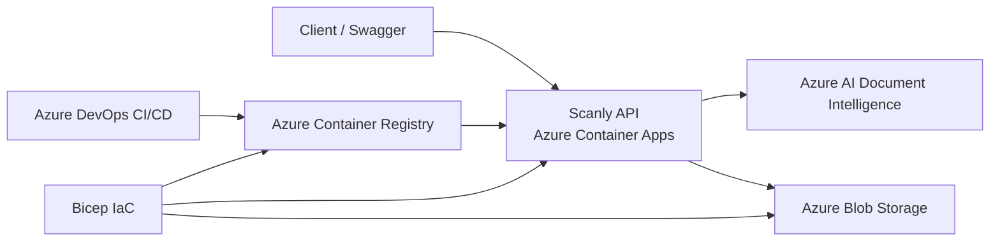

# Scanly Architecture

## 1. System Overview

Scanly is a containerized ASP.NET Core API for invoice processing. The API receives invoice files, sends them to Azure AI Document Intelligence for analysis, maps the result to a Scanly-specific invoice model, and stores the mapped result as JSON in Azure Blob Storage.

The application is deployed to Azure Container Apps. Azure DevOps provides source control, Pull Requests, CI/CD, automated tests, and deployment automation. Azure infrastructure is defined with Bicep.

---

## 2. Main Components

| Component                      | Responsibility                                                                  |
| ------------------------------ | ------------------------------------------------------------------------------- |
| Scanly API                     | Receives invoice uploads and exposes invoice endpoints.                         |
| Azure AI Document Intelligence | Analyzes invoice files and extracts structured data.                            |
| Azure Blob Storage             | Stores mapped invoice results as JSON documents.                                |
| Azure Container Registry       | Stores versioned Docker images.                                                 |
| Azure Container Apps           | Hosts and runs the containerized API.                                           |
| Azure DevOps                   | Provides Git repositories, Work Items, Pull Requests, CI/CD, and collaboration. |
| Bicep                          | Defines and deploys Azure infrastructure as code.                               |

---

## 3. Architecture Diagram



---

## 4. Request and Data Flow

The invoice-processing flow is:

1. A client uploads an invoice through `POST /invoices`.
2. The API validates the request and sends the document to Azure AI Document Intelligence.
3. The analysis result is mapped to the Scanly invoice response model.
4. The mapped result is serialized and stored as JSON in Azure Blob Storage.
5. `GET /invoices/{id}` retrieves one stored invoice result.
6. `GET /invoices` retrieves the stored invoice results available to the application.

The main API endpoints are:

```text
GET  /health
POST /invoices
GET  /invoices/{id}
GET  /invoices
```

---

## 5. Deployment Architecture

The deployment is divided into two Bicep stages:

1. `bootstrap.bicep` creates or updates Azure Container Registry.
2. The pipeline builds the Docker image and tags it with the Azure DevOps Build ID.
3. The image is pushed to ACR.
4. `main.bicep` deploys or updates the remaining infrastructure.
5. Azure Container Apps is configured to use the newly pushed image.
6. The deployed `/health` endpoint is verified automatically.

The two-stage process is required because the registry must exist before the pipeline can push the image and before the Container App can reference the image in ACR.

The main resources deployed by `main.bicep` include:

* Storage Account and Blob container.
* Container Apps Environment.
* Container App.
* System-assigned Managed Identity.
* ACR pull permissions.
* Blob Storage RBAC permissions.
* Application configuration and secrets.
* HTTP-based autoscaling rules.

---

## 6. CI/CD Architecture

The final branch strategy is:

```text
dev  -> CI only
main -> CI + CD
```

The team normally implements each Azure DevOps Task in a separate branch and merges it into `dev` through a Pull Request. The `main` branch contains the stable version and triggers the deployment workflow.

### Continuous Integration

CI performs the following steps:

* Restore .NET dependencies.
* Build the API.
* Build the test project.
* Run automated tests.

The API tests use fake invoice analysis and storage services, so CI does not require access to Azure AI Document Intelligence or Azure Blob Storage.

### Continuous Deployment

CD performs the following steps:

```text
Deploy bootstrap.bicep
        ↓
Build Docker image
        ↓
Tag image with Azure DevOps Build ID
        ↓
Push image to ACR
        ↓
Deploy main.bicep
        ↓
Update Container App
        ↓
Verify /health
```

The Build ID is used as the image tag so that each deployment can be traced to a specific pipeline run and source revision.

---

## 7. Infrastructure as Code

Azure infrastructure is defined with Bicep instead of being configured only through the Azure Portal.

The main infrastructure files are:

```text
infra/
├── bootstrap.bicep
├── main.bicep
├── dev.bicepparam
└── prod.bicepparam
```

Bicep provides:

* Version-controlled infrastructure.
* Repeatable deployments.
* Consistent configuration.
* Easier environment recreation.
* Reduced risk of manual configuration differences.

The templates are intended to be idempotent. Re-running a deployment updates existing resources to match the declared configuration instead of creating unnecessary duplicate resources.

---

## 8. Environment Configuration

The same `main.bicep` template is reused for development and production through separate parameter files.

| Setting          | Development | Production |
| ---------------- | ----------- | ---------- |
| Environment name | `dev`       | `prod`     |
| Minimum replicas | 1           | 2          |
| Maximum replicas | 2           | 5          |

The environment value is included in resource naming so development and production resources remain separate.

Both configurations can be reviewed with Azure CLI `what-if` before deployment.

The production configuration has been validated with `what-if`, but a separate production environment is not deployed as part of this course project.

---

## 9. Security and Credential Handling

### Blob Storage

The application accesses Blob Storage through:

* `DefaultAzureCredential`.
* The Container App system-assigned Managed Identity.
* The `Storage Blob Data Contributor` role.

Storage Account keys and connection strings are not used by the application.

### Azure Container Registry

The Container App uses its Managed Identity to pull images from ACR. The identity is assigned the `AcrPull` role on the registry.

### Azure AI Document Intelligence

Azure AI Document Intelligence uses a course-provided API key because the resource is externally managed and is not created by the Bicep deployment.

The key is supplied through secure configuration and is not hard-coded in the application source code.

Sensitive values are supplied through local environment variables or secure Azure DevOps variables. Local environment scripts containing secrets are excluded through .gitignore and must not be committed to the repository.

---

## 10. Autoscaling

The Container App uses HTTP-based autoscaling with the following configuration:

* HTTP concurrent request threshold: 10.
* Development replicas: 1–2.
* Production replicas: 2–5.

This allows the application to respond to increased traffic while limiting unnecessary resource usage.

---

## 11. Design Decisions and Alternatives

### Container Apps Instead of AKS

Azure Container Apps was selected because the Scanly workload is relatively small, already containerized, and does not require direct Kubernetes cluster management.

Container Apps provides managed container hosting, built-in ingress, autoscaling, revision support, and Managed Identity integration with lower operational complexity.

AKS would provide greater control over networking, scheduling, and Kubernetes resources, but that additional control is not required for the current project.

### Blob Storage Instead of a Database

Blob Storage was selected because each analyzed invoice is stored as an independent JSON document.

A relational database or Cosmos DB would provide stronger querying capabilities, but would add complexity that is not required by the current project scope.

### Managed Identity Instead of Connection Strings

Managed Identity was selected for Blob Storage and ACR because it avoids storing long-lived storage credentials and registry passwords in the application or deployment configuration.

### Bicep Instead of Manual Configuration

Manual Azure Portal configuration was useful during early development and verification.

The final infrastructure is defined with Bicep so that deployments are repeatable, reviewable, and version controlled.

### Container Apps Instead of App Service

Azure App Service could also host the API.

Container Apps was selected because the solution is containerized and the service provides container revision management, ACR integration, and HTTP-based autoscaling.

---

## 12. Known Limitations

* Azure AI Document Intelligence is an external course-provided resource and is not created by the Bicep deployment.
* The project uses a relatively simple Blob Storage persistence model.
* Advanced monitoring and alerting are not included unless implemented separately.
* A separate production environment has not been deployed as part of the course project.
* The current design is optimized for the project scope and may require additional indexing, querying, and observability features for a larger production workload.
