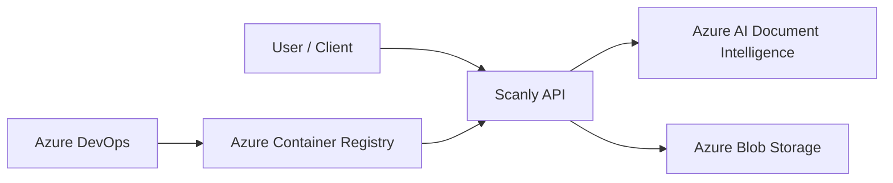

# Scanly AB – Customer Report

## 1. Background

Scanly AB wants to make invoice processing easier for companies.

Handling invoices manually takes time because information such as supplier, invoice number, dates, total amount and line items must be read and entered into other systems.

Our task was to create a cloud-based solution where an invoice can be uploaded and processed automatically.

The project was completed as a team of three students using .NET, Docker, Azure and Azure DevOps.

## 2. Our Solution

We developed a REST API using ASP.NET Core.

A user can upload an invoice as a PDF or image through the API.

The invoice is sent to Azure AI Document Intelligence, where the prebuilt invoice model analyzes the document.

Important information is extracted and mapped to our own Scanly models. The processed result is then stored as JSON in Azure Blob Storage.

The result can later be retrieved through the API.

The main endpoints are:

| Method | Endpoint | Purpose |
| --- | --- | --- |
| GET | `/health` | Check that the API is running |
| POST | `/invoices` | Upload and process an invoice |
| GET | `/invoices/{id}` | Retrieve a specific invoice |
| GET | `/invoices` | Retrieve processed invoices |

## 3. Cloud Architecture

The application is containerized with Docker and hosted in Azure Container Apps.



The main Azure services in the solution are:

- Azure Container Apps for running the API.
- Azure Container Registry for storing Docker images.
- Azure AI Document Intelligence for invoice analysis.
- Azure Blob Storage for processed invoice results.

Bicep is used to describe the Azure infrastructure.

More detailed technical information is available in `ARCHITECTURE.md`.

## 4. Development Process

We organized the project using Azure DevOps.

The work was divided into Product Backlog Items and Tasks. Each team member worked with separate task branches.

Our normal Git workflow was:

```text
task branch -> dev -> main
```

Changes were first developed and tested in a task branch.

We then created a Pull Request to `dev`. This gave the team a chance to review changes before merging them.

The stable version could then be merged to `main`.

Working this way helped us avoid making all changes directly in the same branch.

## 5. Infrastructure and Deployment

The application is packaged as a Docker image.

Azure Container Registry stores the image, and Azure Container Apps runs it.

The Azure infrastructure is defined using Bicep instead of creating everything manually in the Azure Portal.

The main infrastructure files are:

```text
infra/
├── bootstrap.bicep
├── main.bicep
├── dev.bicepparam
└── prod.bicepparam
```

We deployed and tested the development environment.

We also created a separate production parameter configuration. Instead of deploying another complete environment, we validated the production configuration using Bicep `what-if`.

This allowed us to verify the expected infrastructure changes without creating the production resources.

## 6. CI/CD

Azure DevOps is used to automate the build and deployment process.

The pipeline performs the main steps needed to move the application from source code to Azure.

```text
Source code
    |
    v
Build application
    |
    v
Run tests
    |
    v
Build Docker image
    |
    v
Push image to ACR
    |
    v
Deploy to Container Apps
    |
    v
Check /health
```

Docker images are tagged with the Azure DevOps Build ID. This makes it easier to know which application version belongs to a specific pipeline run.

Automating these steps reduces the number of manual deployment steps and makes deployments more consistent.

## 7. Security

We tried to avoid storing credentials directly in the application.

The Azure Container App uses a system-assigned Managed Identity.

The identity is given permission to access Blob Storage using the `Storage Blob Data Contributor` role.

It also receives `AcrPull` permission so that it can access the Docker image in Azure Container Registry.

The application uses `DefaultAzureCredential` when accessing Blob Storage.

Sensitive configuration, such as the Document Intelligence key, is provided using environment variables or secure deployment configuration instead of being written directly in the source code.

## 8. Testing

We tested the main API functionality during development.

The automated tests cover:

```text
GET  /health
POST /invoices
GET  /invoices/{id}
GET  /invoices/{id} -> 404
GET  /invoices
```

The endpoint tests use fake invoice analysis and storage services. This means the CI pipeline can test the API without requiring live Azure AI Document Intelligence and Blob Storage for every test run.

We also tested the application locally and through Docker.

The deployed development environment was used to verify that the application could run in Azure.

## 9. Scaling

The application includes HTTP-based autoscaling configuration.

The development environment uses:

```text
minReplicas = 1
maxReplicas = 2
```

The intended production configuration uses:

```text
minReplicas = 2
maxReplicas = 5
```

We used different values because development does not require the same capacity as a production system.

If Scanly receives more traffic, Container Apps can create additional replicas up to the configured maximum.

## 10. Economy

The cost of the solution depends mainly on the amount of invoice processing and application usage.

The services that contribute to the cost include Azure AI Document Intelligence, Azure Container Apps, Azure Container Registry and Blob Storage.

Document Intelligence usage increases when more invoice pages are analyzed. Container Apps cost also depends on the resources and number of replicas used.

For this reason, autoscaling and suitable development/production configurations are important. Resources should be large enough to handle the workload without running unnecessary capacity.

For a real customer deployment, the estimates should be compared with actual Azure Cost Management data after the application has been running for some time.

## 11. Result

At the end of the project we had a working cloud solution where an invoice can be uploaded through the API, analyzed using Azure AI Document Intelligence and stored as processed JSON data in Azure Blob Storage.

The solution also includes:

- Docker containerization.
- Azure Container Registry.
- Azure Container Apps deployment.
- Managed Identity and RBAC.
- Bicep Infrastructure as Code.
- Development and production parameter configurations.
- Automated API tests.
- Azure DevOps CI/CD.
- HTTP-based autoscaling configuration.

The development environment was deployed and validated.

The production configuration was validated using Bicep `what-if`, but we did not deploy a separate production environment.

## 12. Challenges

One challenge in the project was connecting several different parts of the solution.

The API had to work together with Document Intelligence and Blob Storage, while the Docker image, Azure Container Registry, Container Apps, Bicep and Azure DevOps pipeline also had to work together.

Another challenge was configuration and permissions in Azure. Managed Identity and RBAC require the correct roles to be assigned before the application can access resources.

CI/CD also required several steps to happen in the correct order. For example, the registry must be available before the Docker image can be pushed.

Working through these problems gave us a better understanding of how application development and cloud infrastructure are connected.

## 13. Limitations

The project was developed as a course project and is not a complete production system.

A separate production environment was not deployed.

The current solution could also be improved with more monitoring, more detailed logging, stronger production secret management and more extensive testing.

The scaling configuration was created for the project, but a real production environment would need monitoring and load testing before deciding the final replica limits.

## 14. Future Improvements

Possible future improvements include:

- Add Azure Monitor and Application Insights.
- Improve structured application logging.
- Add more integration and failure tests.
- Improve handling of invalid or unsupported invoice files.
- Add stronger production secret management.
- Perform load testing.
- Monitor Document Intelligence usage and costs.
- Improve API authentication and authorization if the API is opened to real customers.
- Create and test a complete production environment.

## 15. Conclusion

The project showed how a .NET application can be combined with several Azure services to create a complete cloud solution.

We started with an API for invoice processing and connected it to Document Intelligence and Blob Storage.

We then containerized the application, deployed it with Container Apps, defined the infrastructure using Bicep and automated the build and deployment process using Azure DevOps.

The final result meets the main goal of the project: invoices can be uploaded, analyzed and stored through a cloud-based solution.

The project also gave us practical experience with .NET, Docker, Azure services, Infrastructure as Code, security, testing and CI/CD.