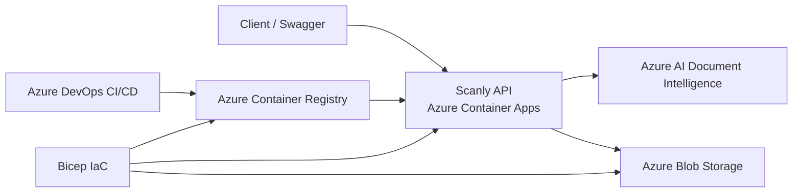

# Scanly AB – Customer Report

## 1. Background

Scanly is a cloud-based .NET solution for invoice processing. The application receives invoice files, analyzes them with Azure AI Document Intelligence, maps the extracted information to Scanly-specific models, and stores the result as JSON in Azure Blob Storage.

The solution is containerized with Docker and deployed to Azure Container Apps. Azure DevOps and Bicep are used for CI/CD and infrastructure deployment.

## 2. Architecture



The Scanly API runs in Azure Container Apps. Uploaded invoices are analyzed by Azure AI Document Intelligence, and the mapped JSON results are stored in Azure Blob Storage.

Azure DevOps builds and deploys the Docker image through Azure Container Registry, while Bicep defines and deploys the Azure infrastructure.

## 3. Infrastructure and Deployment

The Bicep infrastructure was deployed successfully to the existing Azure resource group in `swedencentral`.

Verified resources:

- Azure Container Registry
- Storage Account
- Private Blob container named `invoices`
- Azure Container Apps Environment
- Azure Container App
- System-assigned Managed Identity

The infrastructure files are:

```text
infra/
├── bootstrap.bicep
├── main.bicep
├── dev.bicepparam
└── prod.bicepparam
```

`bootstrap.bicep` creates or updates Azure Container Registry before the Docker image is pushed. `main.bicep` deploys the remaining infrastructure.

Development and production use separate parameter files:

| Setting | Development | Production |
| --- | ---: | ---: |
| Environment | `dev` | `prod` |
| Minimum replicas | 1 | 2 |
| Maximum replicas | 2 | 5 |
| HTTP concurrent request threshold | 10 | 10 |

The development environment was deployed and validated. The production configuration was validated with Bicep `what-if`, but no separate production environment was deployed.

On 25 September 2026, the Docker image `scanly-api:v1` was deployed from Azure Container Registry to Azure Container Apps.

The first deployment failed because ingress and health probes used port 80 while the ASP.NET Core application listens on port 8080. The target port and probe ports were changed to 8080, after which revision `scanly-dev-app--0000002` became healthy and received 100% of the traffic.

## 4. CI/CD

The final branch strategy is:

```text
dev  -> CI only
main -> CI + CD
```

CI performs:

- Restore .NET dependencies
- Build the API
- Build the test project
- Run automated tests

CD performs:

```text
Deploy bootstrap.bicep
        ↓
Build Docker image
        ↓
Tag image with Azure DevOps Build ID
        ↓
Push image to ACR
        ↓
Deploy main.bicep
        ↓
Update Container App
        ↓
Verify /health
```

The Azure DevOps Build ID is used as the Docker image tag so that each deployment can be traced to a specific pipeline run.

If the build or tests fail, the pipeline stops and no deployment is performed.

## 5. Security

Azure Blob Storage is accessed through:

- `DefaultAzureCredential`
- System-assigned Managed Identity
- `Storage Blob Data Contributor`

The Container App uses the same Managed Identity with `AcrPull` to pull images from Azure Container Registry.

Storage Account keys and connection strings are not used by the application.

The Azure AI Document Intelligence key is supplied through local environment variables or secure Azure DevOps / Container App configuration and is not hard-coded in source code.

## 6. Testing and Results

The deployed API was verified through the public HTTPS endpoint.

- Revision: `scanly-dev-app--0000002`
- Health status: Healthy
- Traffic allocation: 100%
- `/health`: HTTP 200 with `{"status":"healthy"}`
- `/swagger`: HTTP 200 and redirect to `/swagger/index.html`

The solution was also validated through:

- Local API execution
- Swagger testing
- Docker container execution
- Automated API tests
- Azure Container Apps deployment
- Automated `/health` verification
- Bicep `what-if` for development
- Bicep `what-if` for production configuration

## 7. Problems and Solutions

### Incorrect Container App Port

The initial deployment used port 80 for ingress and health probes, while the ASP.NET Core application listens on port 8080.

This caused the deployed revision to fail its startup probes.

The ingress target port and the startup, readiness, and liveness probe ports were changed to 8080. After the change, the new Container App revision became healthy.

### Registry and Image Deployment Order

The Docker image cannot be pushed before Azure Container Registry exists.

The deployment was therefore split into two stages. `bootstrap.bicep` creates or updates ACR first. The pipeline then builds and pushes the Docker image before `main.bicep` deploys the remaining infrastructure and configures the Container App.

## 8. Economy and Scaling

The development environment uses 1–2 replicas, while the intended production configuration uses 2–5 replicas. The HTTP concurrent request threshold is configured as 10.

The detailed cost analysis, including estimated monthly cost, scaling with increased customer volume, the most expensive Azure resource, and expected bottlenecks, is documented in `ARCHITECTURE.md`.

The production scaling configuration was validated with Bicep `what-if`, but no separate production environment was deployed.

## 9. Reflection

### Qian
_To be completed before final submission._

### Ramya
_To be completed before final submission._

### Zara
_To be completed before final submission._